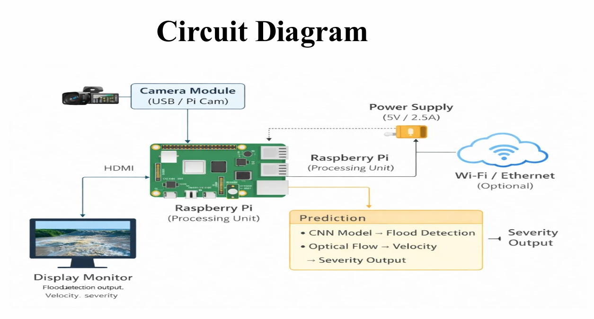
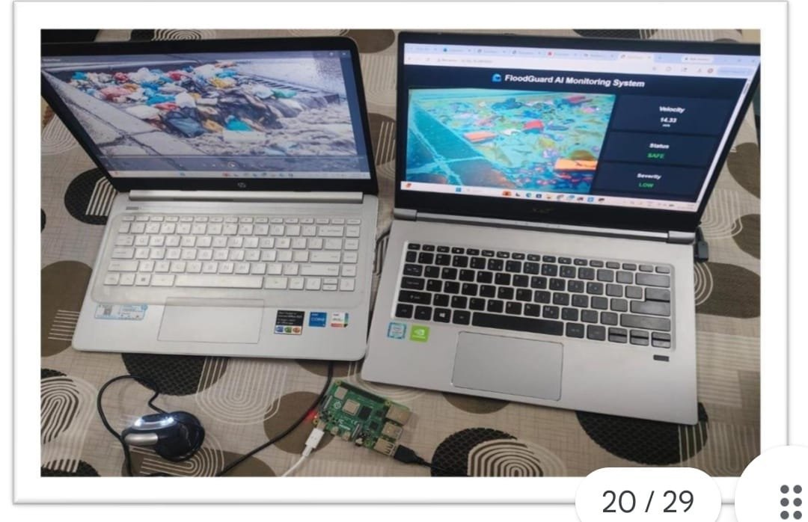
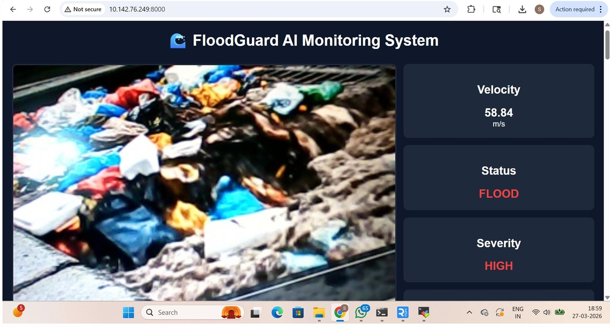

# FloodGuard-AI

## Overview

FloodGuard-AI is an AI-powered flood monitoring system developed as a Final Year Project.

The system combines Computer Vision, Deep Learning, and Raspberry Pi edge computing to monitor flood conditions in real time.

---

## Features

- AI-based flood detection
- Raspberry Pi deployment
- TensorFlow Lite model
- Real-time monitoring
- Video processing
- Flood severity analysis

---

## Technologies Used

- Python
- TensorFlow
- TensorFlow Lite
- OpenCV
- Raspberry Pi
- Computer Vision

---

## Project Architecture



---

## Hardware Setup



---

## Dashboard



---

## Detection Result


---

## Repository Structure

```
FloodGuard-AI/
│
├── images/
├── project_code.py
├── train.py
├── video.py
├── lucasvideo.py
├── lucasres.py
├── requirements.txt
└── flood_model.tflite
```

---

## Future Improvements

- IoT Sensor Integration
- Mobile App
- Cloud Dashboard
- SMS Alert System

---

## Author

Saumya Tamrakar
